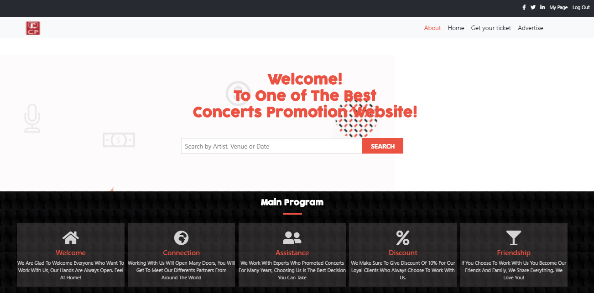
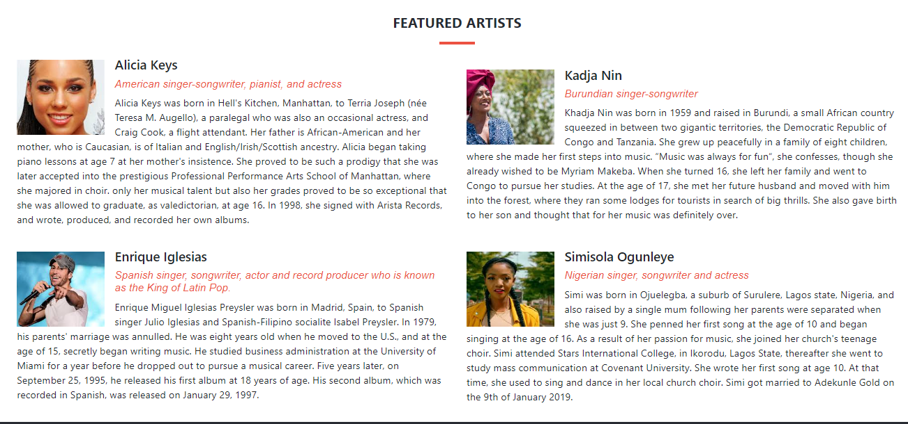

# Capstone-Project

This project consists of a HTML & CSS Capstone Project, based on an online website for a conference. It's a real-world-like project, built with business specifications.

​
## Project Requirements
Required to work atleast on 3 pages:
- The main page, with a menu link to the about page and tickets page
- The about page
- The ticket page

Each of these pages should have versions for 2 different screen sizes: 

- mobile: up to 768px
- desktop: from 768px

We should follow the guidelines of the given design, including:

- colors
- typographies: font face, size and weight
- layout: composition and space between elements, for the 2 given screen sizes

## Built With

- HTML
- CSS
- Bootstrap
​
## Live Demo
[Live Demo Link](https://delicelydia.github.io/Capstone-Project/.)
​
## Author
- Github: [@DeliceLydia](https://github.com/DeliceLydia)
- Twitter: [@IngabireLydia3](https://twitter.com/IngabireLydia)
- Linkedin: [Delice Lydia](https://www.linkedin.com/in/delice-lydia-91b55b167/)

## Acknowledgments
- Huge Thanks to 
[Benhance](https://www.behance.net/gallery/29845175/CC-Global-Summit-2015) and Cindy Shin for the design

## Demo Video
[Loom Video Link](https://www.loom.com/share/5bc03955088042a7acc511a3e1256dab)

## Show your support
​
Give a ⭐️ if you like this project!

